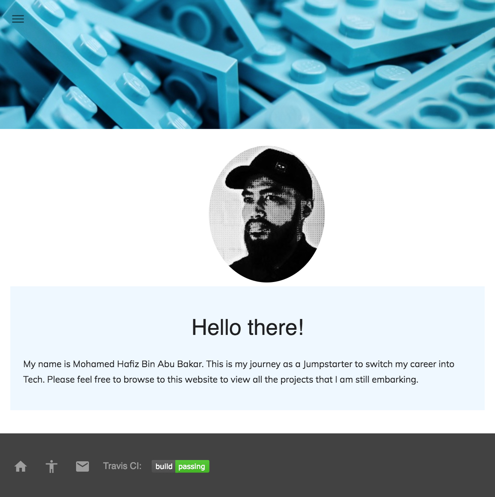
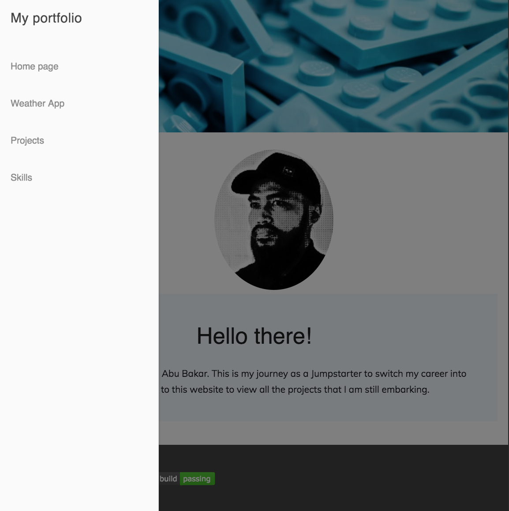
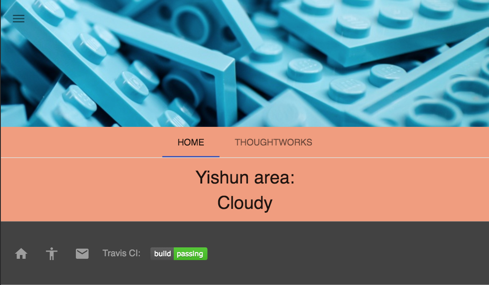
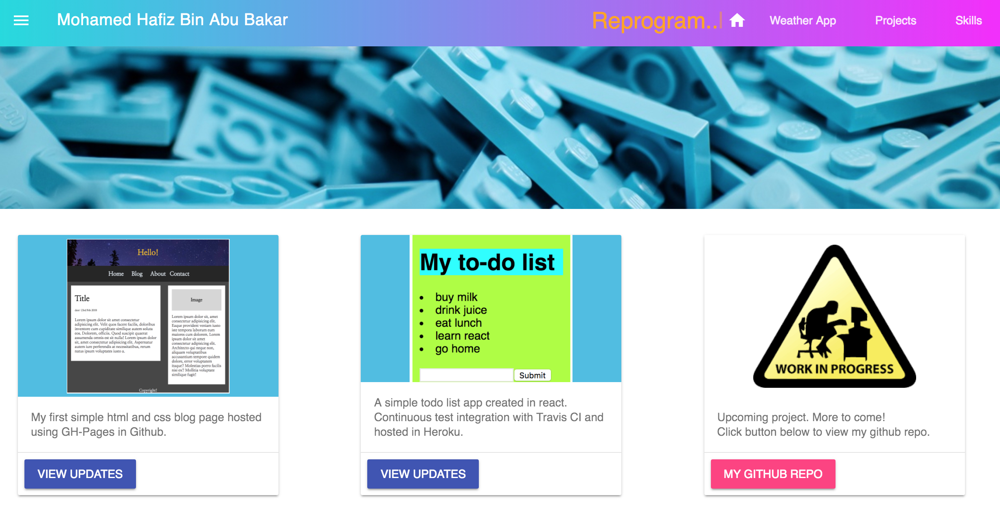
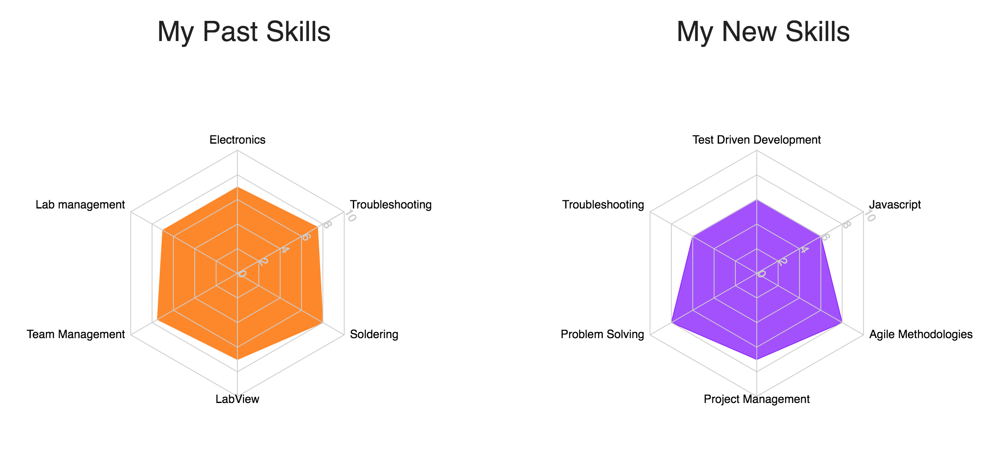

# My portfolio landing page

This is a showcase of my new journey in web development as a Jumpstarter. In this landing page, I include my new skills that I acquired, the projects that I am doing and links to my profile (linkedIn, email etc.)

## Snapshots of the web app

####homepage


<br/><br/>

#####app-drawer
To access the menu, click on the hamburger icon at the top left hand corner of the web app.

<br/><br/>

#####weather-app
Shows the 2 hours realtime weather data from data.gov.sg API.

<br/><br/>

#####my-projects
Showcase of my past and future projects.

<br/><br/>

#####my-skills
Showcase of my past and current skills.<br/>


## Getting Started

These instructions will get you a copy of the project up and running on your local machine for your own testing purposes. See deployment for notes on how to deploy the project on a live system.

### Prerequisites

Steps to have the web app running on your local machine

```
1) Fork the repo
2) git clone https://github.com/Mohafizz/mini-project-my-portfolio.git
```

## Built With

This project was bootstrapped with [Create React App](https://github.com/facebookincubator/create-react-app).
